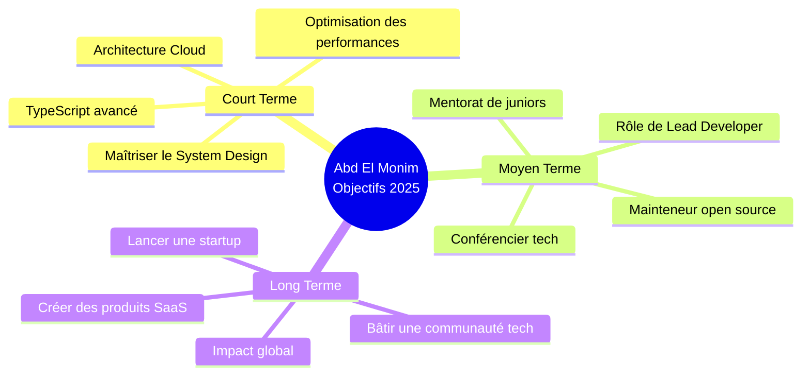

# Salut, moi c’est Abd El Monim Mazgoura ! 👋

<div align="center">
  
[](https://git.io/typing-svg)

</div>

<div align="center">
  
[](https://www.linkedin.com/in/abd-el-monim-mazgoura-webfullstack/)
[](https://abdelmonim-mazgoura.vercel.app)
[](mailto:mazgouraabdalmounim@gmail.com)
[](https://github.com/ABDE777)


</div>

---

## 🎯 À propos de moi

<div align="center">

### 👨‍💻 Développeur Full Stack | Passionné d’innovation digitale | Futur entrepreneur tech

</div>

<table>
<tr>
<td width="50%" valign="top">


</td>
<td width="50%" valign="top">

<br/>

```typescript
const abdElMonim = {
  localisation: "📍 Casablanca, Maroc 🇲🇦",
  age: 19,
  role: "Développeur Full Stack",
  formation: "Spécialiste en Développement Digital",
  
  apprentissageActuel: [
    "System Design",
    "Architecture Cloud",
    "TypeScript avancé"
  ],
  
  passions: [
    "🚀 Création d’applications scalables",
    "🎨 Conception d’interfaces modernes",
    "🤝 Contribution open source",
    "📚 Apprentissage continu"
  ],
  
  devise: "Construire les solutions d’aujourd’hui
           avec les technologies de demain"
};
```

</td>
</tr>
</table>

<div align="center">

### 💡 Ce qui me motive

<table>
<tr>
<td align="center" width="20%">

<br/><b>Passion</b>
<br/><sub>Excellence en développement web</sub>
</td>
<td align="center" width="20%">

<br/><b>Apprentissage</b>
<br/><sub>Nouvelles technologies</sub>
</td>
<td align="center" width="20%">

<br/><b>Innovation</b>
<br/><sub>Solutions créatives</sub>
</td>
<td align="center" width="20%">

<br/><b>Collaboration</b>
<br/><sub>Évolution en équipe</sub>
</td>
<td align="center" width="20%">

<br/><b>Ambition</b>
<br/><sub>Réussite entrepreneuriale</sub>
</td>
</tr>
</table>

</div>

<div align="center">

### 🌟 Pourquoi me recruter ?

| 💼 Expérience | 🚀 Innovation | 🤝 Collaboration |
|:---:|:---:|:---:|
| Livraison de projets réels | Maîtrise des stacks modernes | Leadership et esprit d’équipe |
| Compétences full stack | Résolution de problèmes | Contribution open source |
| Code prêt pour la production | Optimisation des performances | Communication claire |

</div>

---

## 🎯 Objectifs actuels & vision

<div align="center">



</div>

---

## 🛠️ Stack technique

### 💻 Frontend
React • Next.js • TypeScript • Redux • Tailwind CSS • Vite • JavaScript • HTML5 • CSS3 • Bootstrap

### ⚙️ Backend
Node.js • Express.js • Laravel • PHP • Python • JWT

### 🗄️ Bases de données & Cloud
MongoDB • MySQL • PostgreSQL • Supabase • Firebase

### 🚀 DevOps & Outils
Git • GitHub • GitLab • Docker • Vercel • Netlify • Postman • Jira • VS Code • Figma

---

## 🏆 Projets phares

### 🎓 ISFO Pro
Système digital de gestion des attestations académiques avec génération automatique de certificats PDF et suivi en temps réel.

Impact : réduction de 80 % du temps de traitement.

---

### 🎨 CSSBattle ISFO
Plateforme de compétition CSS en temps réel avec classement automatique et intégration GitHub Actions.

Impact : 50+ participants actifs, 200+ challenges réalisés.

---

### 🛍️ ANAS FRAGRANCES
Plateforme e-commerce moderne pour parfums de luxe avec panier, paiement sécurisé et panneau d’administration multilingue.

Impact : +30 % d’engagement client.

---

## 📊 Statistiques GitHub
Activité constante, contributions régulières et spécialisation en JavaScript / TypeScript.

---

## 🎓 Certifications & distinctions

- Introduction à l’IA moderne – Cisco (2025)
- Full Stack Web (CSS, JS, PHP) – Udemy
- UI/UX Design avec Figma – Udemy
- Top 39 mondial – CSSBattle.dev
- Responsable IT Club – ISFO

---

## 🎯 Ce que je recherche

- Postes de développeur Full Stack
- Startups innovantes
- Projets open source à impact réel
- Environnements favorisant la croissance

---

## 💬 Construisons quelque chose d’exceptionnel ensemble

Langues : Arabe (natif) • Français (B2) • Anglais (B2)

⭐️ « Un code propre donne toujours l’impression d’avoir été écrit par quelqu’un qui s’en soucie. »

