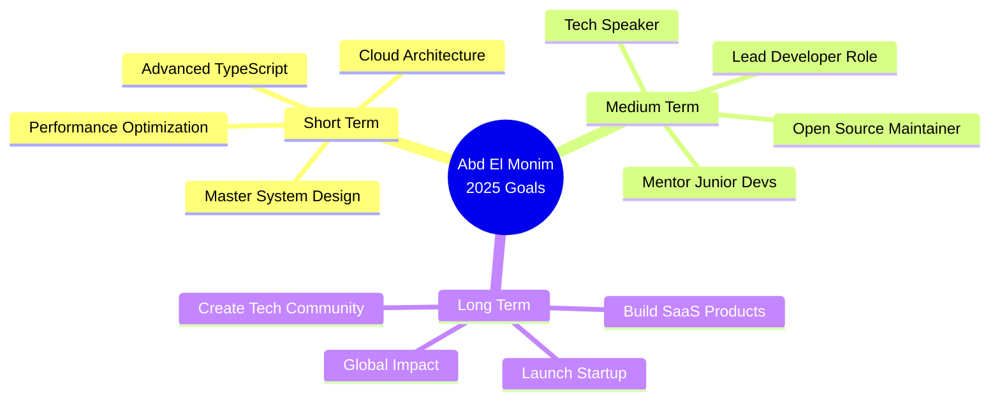

# Hi there, I'm Abd El Monim Mazgoura! 👋

<div align="center">
  
[](https://git.io/typing-svg)

</div>

<div align="center">
  
[](https://www.linkedin.com/in/abd-el-monim-mazgoura-webfullstack/)
[](https://abdelmonim-mazgoura.vercel.app)
[](mailto:mazgouraabdalmounim@gmail.com)
[](https://github.com/ABDE777)


</div>


## 🎯 About Me


```javascript
const abdElMonim = {
    location: "📍 Casablanca, Morocco 🇲🇦",
    age: 19,
    role: "Full Stack Developer",
    education: "Technician Specialized in Digital Development",
    passions: ["Web Development", "Problem Solving", "Innovation"],
    currentFocus: "Building high-performance web applications",
    lifeGoal: "Launch my own tech startup 🚀",
    motto: "Building today's solutions with tomorrow's technologies"
};
```

### 💫 Quick Facts

- 🔭 Currently working on **innovative full-stack projects**
- 🌱 Learning **advanced system design & cloud architecture**
- 👯 Looking to collaborate on **open source & startup projects**
- 💬 Ask me about **React, Next.js, Node.js, TypeScript**
- ⚡ Fun fact: **Top 39 globally on CSSBattle.dev**
- 🎯 2025 Goal: **Contribute to 50+ open source projects**


## 🛠️ Tech Stack

### 💻 Frontend Magic

<p align="center">
  
</p>

### ⚙️ Backend Power

<p align="center">
  
</p>

### 🗄️ Database & Cloud

<p align="center">
  
</p>

### 🚀 DevOps & Tools

<p align="center">
  
</p>


## 🏆 Featured Projects

<div align="center">

| 🎓 **ISFO Pro** | 🎨 **CSSBattle ISFO** | 🛍️ **ANAS FRAGRANCES** |
|:---:|:---:|:---:|
| Digital Certificate Management | Real-Time CSS Competition | Luxury E-Commerce Platform |
|    |   |   |
| ⭐ 80% faster processing | ⭐ 50+ active users | ⭐ 30% more engagement |
| [View Project →](https://github.com/ABDE777/isfo-pro) | [View Project →](https://github.com/ABDE777/cssbattle-isfo) | [View Project →](https://github.com/ABDE777/anas-fragrances) |

</div>


## 📊 GitHub Analytics

<div align="center">
  
  
</div>

<div align="center">
  
  
</div>

<div align="center">
  
</div>


## 🎓 Achievements & Certifications

<div align="center">

| 🏆 Achievement | 📅 Date | 🎯 Impact |
|:---|:---:|:---|
| 🥇 **Top 39 Global** - CSSBattle.dev | Ongoing | Elite CSS Problem Solver |
| 🤖 **Modern AI** - Cisco | Apr 2025 | AI & ML Fundamentals |
| 💻 **Full Stack Web Dev** - Udemy | Jan 2025 | Complete Web Development |
| 🎨 **UI/UX Masterclass** - Udemy | Sep 2024 | Design Thinking & Figma |
| 👥 **IT Club Leader** - ISFO | 2024-Present | Community Leadership |

</div>


## 🎯 Current Focus & Goals

<div align="center">



</div>


## 📈 Coding Activity

<div align="center">

<!--START_SECTION:waka-->
```text
TypeScript   █████████████████░░░░   68.5%
JavaScript   ████████░░░░░░░░░░░░░   32.1%
CSS          ███░░░░░░░░░░░░░░░░░░   12.8%
HTML         ██░░░░░░░░░░░░░░░░░░░    8.4%
Python       ██░░░░░░░░░░░░░░░░░░░    7.2%
```
<!--END_SECTION:waka-->

</div>


## 💼 What I'm Looking For

<div align="center">

### 🤝 Open to Collaborate On:

🚀 **Innovative Startups** • 💡 **Open Source Projects** • 🏢 **Full-Stack Roles** • 🎓 **EdTech Platforms** • ⚡ **SaaS Products**

### 🌟 I Bring to the Table:

✅ Production-Ready Code • ✅ Modern Tech Stack • ✅ Team Leadership • ✅ Problem-Solving • ✅ Fast Learning • ✅ Clear Communication

</div>


## 📫 Let's Connect!

<div align="center">

[](https://www.linkedin.com/in/abd-el-monim-mazgoura-webfullstack/)
[](https://abdelmonim-mazgoura.vercel.app)
[](mailto:mazgouraabdalmounim@gmail.com)
[](https://github.com/ABDE777)

### 🌍 Languages
**🇲🇦 Arabic** (Native) • **🇫🇷 French** (B2) • **🇬🇧 English** (B2)

<br/>


</div>


<div align="center">

### 🐍 Contribution Snake


### ⚡ Recent Activity

<!--START_SECTION:activity-->
<!--END_SECTION:activity-->

---


<sub>💖 Created with passion by [Abd El Monim Mazgoura](https://github.com/ABDE777)</sub>

</div>
