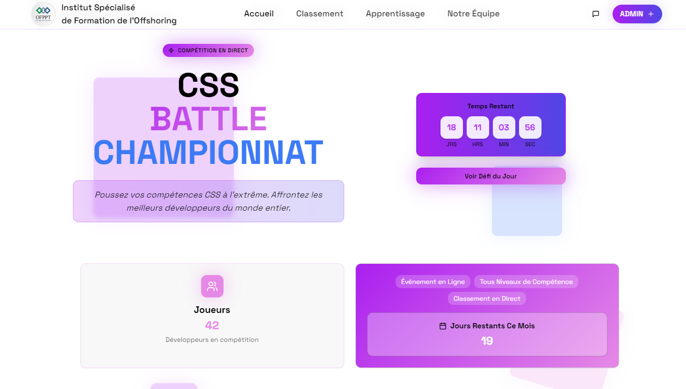
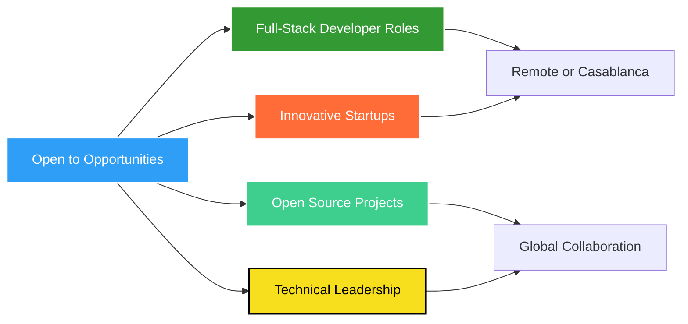

# Hi there, I'm Abd El Monim Mazgoura! 👋

<div align="center">
  
[](https://git.io/typing-svg)

</div>

<div align="center">
  
[](https://www.linkedin.com/in/abd-el-monim-mazgoura-webfullstack/)
[](https://abdelmonim-mazgoura.vercel.app)
[](mailto:mazgouraabdalmounim@gmail.com)
[](https://github.com/ABDE777)


</div>

---

## 🎯 About Me

```typescript
const abdElMonim = {
  location: "Casablanca, Morocco 🇲🇦",
  education: "Technician Specialized in Digital Development",
  role: "Full Stack Web Developer & IT Club Leader",
  
  currentFocus: {
    learning: ["Advanced React Patterns", "System Design", "DevOps & CI/CD"],
    building: "Scalable web applications with modern tech stacks",
    achieving: "Senior developer status through continuous innovation"
  },
  
  achievements: {
    cssRank: "Top 39 Global on CSSBattle.dev 🏆",
    leadership: "Leading IT Club & organizing tech workshops",
    projects: "15+ full-stack projects deployed"
  },
  
  funFact: "I turn coffee into code and CSS into art! ☕🎨"
};
```

<div align="center">

### 🌟 **Why Hire Me?**

| 💼 **Experience** | 🚀 **Innovation** | 🤝 **Collaboration** |
|:---:|:---:|:---:|
| Real-world project delivery | Modern tech stack expertise | Strong team leadership |
| Full-stack proficiency | Problem-solving mindset | Open source contributor |
| Production-ready code | Performance optimization | Clear communication |

</div>

---

## 🛠️ Tech Arsenal

<details open>
<summary><b>💻 Frontend Development</b></summary>
<br/>


</details>

<details open>
<summary><b>⚙️ Backend Development</b></summary>
<br/>


</details>

<details open>
<summary><b>🗄️ Database & Cloud</b></summary>
<br/>


</details>

<details open>
<summary><b>🚀 DevOps & Tools</b></summary>
<br/>


</details>

---

## 🏆 Featured Projects

> **Note:** Click on project titles to view the live demo or repository!

<table>
<tr>
<td width="50%">

### 🎓 [ISFO Pro](https://github.com/ABDE777/isfo-pro)
**Digital Certificate Management System**

A comprehensive full-stack solution for modernizing academic attestation management with real-time tracking and automated certificate generation.

**🔑 Key Features:**
- ✅ Role-based authentication & authorization
- ✅ Real-time admin & student dashboards
- ✅ Automatic PDF certificate generation
- ✅ Request tracking & status updates
- ✅ Responsive modern UI/UX

**🛠 Tech Stack:**


**📊 Impact:** Reduced certificate processing time by 80%

</td>
<td width="50%">


> *Replace with your actual screenshot URL*
> 
> **Or use a placeholder:**
> `https://via.placeholder.com/600x400/1a1b27/2e9ef7?text=ISFO+Pro+Screenshot`

</td>
</tr>

<tr>
<td width="50%">



> *Replace with your actual screenshot URL*
> 
> **Or use a placeholder:**
> `https://via.placeholder.com/600x400/1a1b27/f7df1e?text=CSSBattle+ISFO+Screenshot`

</td>
<td width="50%">

### 🎨 [CSSBattle ISFO](https://github.com/ABDE777/cssbattle-isfo)
**Real-Time CSS Competition Platform**

An engaging platform for CSS challenges with live leaderboards, automated scoring, and GitHub Actions integration.

**🔑 Key Features:**
- ✅ Daily CSS challenges with real-time updates
- ✅ Automated scoring & ranking system
- ✅ Live leaderboard with user profiles
- ✅ GitHub Actions for automation
- ✅ Playwright integration for testing

**🛠 Tech Stack:**


**📊 Impact:** 50+ active participants, 200+ challenges completed

</td>
</tr>

<tr>
<td width="50%">

### 🛍️ [ANAS FRAGRANCES](https://github.com/ABDE777/anas-fragrances)
**Luxury Perfume E-Commerce Platform**

A modern, feature-rich e-commerce platform delivering premium shopping experience with multi-language support and secure transactions.

**🔑 Key Features:**
- ✅ Complete shopping cart & checkout flow
- ✅ Product catalog with filtering & search
- ✅ Order tracking & management
- ✅ Multi-language admin panel
- ✅ Secure authentication system

**🛠 Tech Stack:**


**📊 Impact:** 30% increase in customer engagement

</td>
<td width="50%">


> *Replace with your actual screenshot URL*
> 
> **Or use a placeholder:**
> `https://via.placeholder.com/600x400/1a1b27/ff5722?text=ANAS+FRAGRANCES+Screenshot`

</td>
</tr>
</table>

---

## 📊 GitHub Analytics

<div align="center">
  


</div>

---

## 🎓 Certifications & Achievements

<div align="center">

| 🏆 Achievement | 📅 Date | 🎯 Focus Area |
|:---|:---:|:---|
| **Introduction to Modern AI** - Cisco | April 2025 | Artificial Intelligence & Machine Learning |
| **CSS, Bootstrap, JavaScript, PHP Full Stack** - Udemy | Jan 2025 | Web Development Fundamentals |
| **Figma: UI/UX Design Masterclass** - Udemy | Sept 2024 | Interface Design & Prototyping |
| **Top 39 Global Rank** - CSSBattle.dev | Ongoing | Advanced CSS & Creative Problem-Solving |
| **IT Club Leadership** - ISFO | 2024-Present | Team Management & Workshop Facilitation |

</div>

---

## 🎯 What I'm Looking For

<div align="center">



</div>

### 💼 Ideal Collaboration

- 🚀 **Startups** building the next big thing
- 🌟 **Open Source** projects making real impact
- 🏢 **Companies** valuing innovation and growth
- 🎓 **EdTech** platforms transforming education
- 💡 **SaaS Products** solving real-world problems

---

## 💬 Let's Build Something Amazing Together!

<div align="center">

### 🤝 I'm Always Open To:

**Discussing new projects** • **Collaborating on open source** • **Sharing knowledge** • **Networking with developers** • **Exploring opportunities**

<br/>

[](https://www.linkedin.com/in/abd-el-monim-mazgoura-webfullstack/)
[](https://abdelmonim-mazgoura.vercel.app)
[](mailto:mazgouraabdalmounim@gmail.com)

<br/>

### 🌍 Languages
**Arabic** (Native) • **French** (B2) • **English** (B2)

<br/>


---

<sub>⭐️ From [ABDE777](https://github.com/ABDE777) with ❤️ | *"Clean code always looks like it was written by someone who cares."*</sub>

</div>
