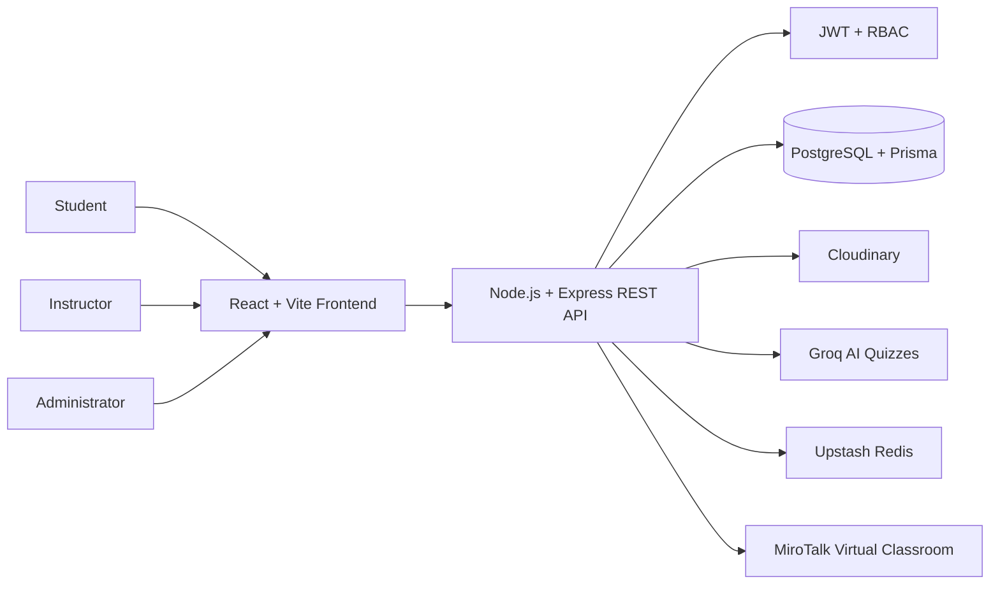

<div align="center">

# Abd El Monim Mazgoura

### Junior Full-Stack Web Developer

Building useful web products with **React, Node.js and Spring Boot**

[](https://abdelmonim-mazgoura.vercel.app/)
[](https://www.linkedin.com/in/abd-el-monim-mazgoura-webfullstack/)
[](mailto:mazgouraabdalmounim@gmail.com)
[](https://github.com/ABDE777)


</div>

---

## About me

I am a junior web developer based in **Casablanca, Morocco**, focused on building reliable and maintainable full-stack applications. I enjoy turning business requirements into clear interfaces, secure APIs and practical digital products.

- Currently working at **Wafa IMA Assistance**.
- Completed a full-stack internship at **Wafa Assurance**.
- Specialized Technician in Digital Development, Web Full Stack, at **OFPPT**.
- Open to junior **React, Node.js and Full-Stack** opportunities.

## What I build

<div align="center">


<br/>

<br/>

<br/>


</div>

- Responsive interfaces with React, TypeScript, Tailwind CSS and Material UI.
- REST APIs with Node.js/Express and Spring Boot.
- Secure applications with JWT, OAuth2, Keycloak and role-based access control.
- Data-driven systems using PostgreSQL, MongoDB, MySQL, Prisma and Supabase.
- Real-time features with WebSocket/STOMP.
- Cloud-ready applications using Docker, Cloudinary, Vercel and CI/CD workflows.

## Featured projects

<table>
<tr>
<td width="50%" valign="top">

### <a href="https://212-learn.vercel.app/">212LEARN</a>

**Full-stack e-learning platform**

A Moroccan learning platform for students, instructors and administrators. It supports courses, lessons, resources, assignments, quizzes, learner progress, certificates, cart, coupons, enrollment, payment flows, dashboards, notifications, virtual classrooms and AI-assisted quiz generation.

`React` `Node.js` `Express` `Prisma` `PostgreSQL` `JWT` `Groq`

</td>
<td width="50%" valign="top">

### SI Expert Assurance

**Automotive expertise management**

Business application developed during my internship at Wafa Assurance to manage missions, photos, estimates, statuses and timelines. Includes secured Spring Boot APIs and real-time notifications.

`React 19` `Redux Toolkit` `Material UI` `Spring Boot` `PostgreSQL` `Keycloak`

</td>
</tr>
<tr>
<td width="50%" valign="top">

### ISFO Digital

**Administrative and academic management**

Full-stack platform for trainees, absences, sanctions, schedules, assessments, grades and certificates. Includes JWT authentication, multiple roles, analytics, audit logging and QR-code verification.

`React` `Node.js` `Express` `PostgreSQL` `Prisma`

</td>
<td width="50%" valign="top">

### CSSBattle ISFO

**Real-time CSS challenge platform**

A student-focused platform with daily CSS challenges and live rankings, designed to improve frontend creativity and speed.

`React` `Tailwind CSS` `Supabase`

</td>
</tr>
</table>

## 212LEARN architecture


```mermaid
flowchart LR
    Student[Student] --> Web[React + Vite Frontend]
    Instructor[Instructor] --> Web
    Admin[Administrator] --> Web
    Web --> API[Node.js + Express REST API]
    API --> Auth[JWT + RBAC]
    API --> DB[(PostgreSQL + Prisma)]
    API --> Media[Cloudinary]
    API --> AI[Groq AI Quizzes]
    API --> Cache[Upstash Redis]
    API --> Live[MiroTalk Virtual Classroom]
```

## Engineering focus

```text
Product idea
    -> Responsive UI
    -> Secure REST API
    -> Data model and role-based access
    -> Tests and validation
    -> Cloud deployment
```

## Experience and education

| Role | Organization | Period |
| --- | --- | --- |
| Chargé de compte sinistre automobile | Wafa IMA Assistance | June 2026 – Present |
| Full-Stack Developer Intern | Wafa Assurance | March 2026 – April 2026 |
| Training & Projects Manager / Ambassador | IT Club, OFPPT/ISFO | April 2025 – Present |
| Specialized Technician, Digital Development — Web Full Stack | OFPPT Casablanca | 2024 – 2026 |

## Certifications and languages

- MongoDB — From Relational Model to Document Model
- Cisco — Introduction to Modern AI
- Advanced Web Development
- Git version control
- Figma / UI-UX Design
- JavaScript Fundamentals
- Arabic: Native · French: B2 · English: B2

## Open to opportunities

I am looking for a junior role where I can contribute to real products, learn from experienced engineers and grow within a collaborative team.

**React Developer · Node.js Developer · JavaScript Developer · Junior Full-Stack Developer**

<div align="center">

### Let’s build something useful.

[](https://abdelmonim-mazgoura.vercel.app/)

</div>
