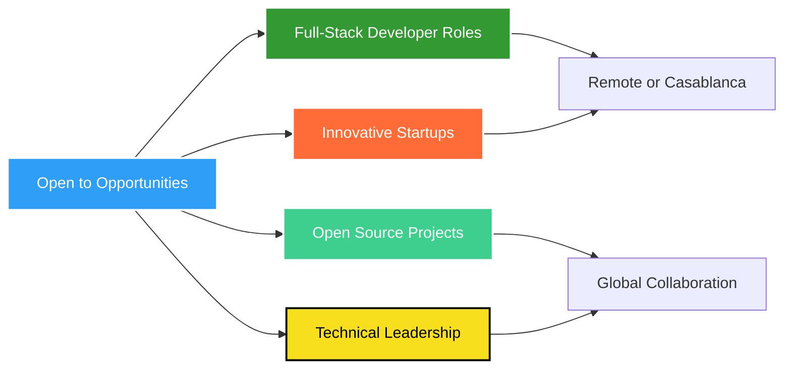

# Hi there, I'm Abd El Monim Mazgoura! üëã

<div align="center">
  
[](https://git.io/typing-svg)

</div>

<div align="center">
  
[](https://www.linkedin.com/in/abd-el-monim-mazgoura-webfullstack/)
[](https://abdelmonim-mazgoura.vercel.app)
[](mailto:mazgouraabdalmounim@gmail.com)
[](https://github.com/ABDE777)


</div>

---

## 🎯 About Me

```typescript
const abdElMonim = {
  location: "Casablanca, Morocco 🇲🇦",
  education: "Technician Specialized in Digital Development",
  role: "Full Stack Web Developer & IT Club Leader",
  
  currentFocus: {
    learning: ["Advanced React Patterns", "System Design", "DevOps & CI/CD"],
    building: "Scalable web applications with modern tech stacks",
    achieving: "Senior developer status through continuous innovation"
  },
  
  achievements: {
    cssRank: "Top 39 Global on CSSBattle.dev 🏆",
    leadership: "Leading IT Club & organizing tech workshops",
    projects: "15+ full-stack projects deployed"
  },
  
  funFact: "I turn coffee into code and CSS into art! ‚òïüé®"
};
```

<div align="center">

### üåü **Why Hire Me?**

| 💼 **Experience** | 🚀 **Innovation** | 🤝 **Collaboration** |
|:---:|:---:|:---:|
| Real-world project delivery | Modern tech stack expertise | Strong team leadership |
| Full-stack proficiency | Problem-solving mindset | Open source contributor |
| Production-ready code | Performance optimization | Clear communication |

</div>

---

## 🛠️ Tech Arsenal

<div align="center">


```mermaid
graph TD
    A[🚀 Full Stack Web Developer] --> B[💻 Frontend Development]
    A --> C[⚙️ Backend Development]
    A --> D[🗄️ Database & Cloud]
    A --> E[üîß DevOps & Tools]
    
    B --> B1[React & Next.js]
    B --> B2[TypeScript & JavaScript]
    B --> B3[Tailwind CSS & Bootstrap]
    B --> B4[Redux & State Management]
    B --> B5[Vite & Build Tools]
    
    C --> C1[Node.js & Express.js]
    C --> C2[PHP & Laravel]
    C --> C3[Python]
    C --> C4[REST APIs & JWT]
    
    D --> D1[SQL: MySQL & PostgreSQL]
    D --> D2[NoSQL: MongoDB]
    D --> D3[Cloud: Supabase & Firebase]
    
    E --> E1[Git & GitHub/GitLab]
    E --> E2[Docker & Containerization]
    E --> E3[Vercel & Netlify]
    E --> E4[Postman & Testing]
    E --> E5[VS Code & Figma]
    
    style A fill:#2e9ef7,stroke:#fff,stroke-width:3px,color:#fff
    style B fill:#61dafb,stroke:#fff,stroke-width:2px,color:#000
    style C fill:#339933,stroke:#fff,stroke-width:2px,color:#fff
    style D fill:#3ecf8e,stroke:#fff,stroke-width:2px,color:#000
    style E fill:#ff6c37,stroke:#fff,stroke-width:2px,color:#fff
    
    style B1 fill:#20232a,stroke:#61dafb,stroke-width:2px,color:#fff
    style B2 fill:#007acc,stroke:#fff,stroke-width:2px,color:#fff
    style B3 fill:#38b2ac,stroke:#fff,stroke-width:2px,color:#fff
    style B4 fill:#593d88,stroke:#fff,stroke-width:2px,color:#fff
    style B5 fill:#646cff,stroke:#fff,stroke-width:2px,color:#fff
    
    style C1 fill:#339933,stroke:#fff,stroke-width:2px,color:#fff
    style C2 fill:#ff2d20,stroke:#fff,stroke-width:2px,color:#fff
    style C3 fill:#3776ab,stroke:#fff,stroke-width:2px,color:#fff
    style C4 fill:#000000,stroke:#fff,stroke-width:2px,color:#fff
    
    style D1 fill:#4479a1,stroke:#fff,stroke-width:2px,color:#fff
    style D2 fill:#47a248,stroke:#fff,stroke-width:2px,color:#fff
    style D3 fill:#3ecf8e,stroke:#fff,stroke-width:2px,color:#000
    
    style E1 fill:#f05032,stroke:#fff,stroke-width:2px,color:#fff
    style E2 fill:#2496ed,stroke:#fff,stroke-width:2px,color:#fff
    style E3 fill:#00c7b7,stroke:#fff,stroke-width:2px,color:#fff
    style E4 fill:#ff6c37,stroke:#fff,stroke-width:2px,color:#fff
    style E5 fill:#007acc,stroke:#fff,stroke-width:2px,color:#fff
```

</div>

### 📦 Detailed Tech Stack

<table>
<tr>
<td width="25%" align="center">

**💻 Frontend**


</td>
<td width="25%" align="center">

**⚙️ Backend**


</td>
<td width="25%" align="center">

**🗄️ Database**


</td>
<td width="25%" align="center">

**üîß DevOps**


</td>
</tr>
</table>

---

## 🏆 Featured Projects

> **Note:** Click on project titles to view the live demo or repository!

<table>
<tr>
<td width="50%">

### üéì [ISFO Pro](https://github.com/ABDE777/isfo-pro)
**Digital Certificate Management System**

A comprehensive full-stack solution for modernizing academic attestation management with real-time tracking and automated certificate generation.

**üîë Key Features:**
- ‚úÖ Role-based authentication & authorization
- ‚úÖ Real-time admin & student dashboards
- ‚úÖ Automatic PDF certificate generation
- ‚úÖ Request tracking & status updates
- ‚úÖ Responsive modern UI/UX

**üõ† Tech Stack:**


**üìä Impact:** Reduced certificate processing time by 80%

</td>
<td width="50%">


> *Replace with your actual screenshot URL*
> 
> **Or use a placeholder:**
> `https://via.placeholder.com/600x400/1a1b27/2e9ef7?text=ISFO+Pro+Screenshot`

</td>
</tr>

<tr>
<td width="50%">


> *Replace with your actual screenshot URL*
> 
> **Or use a placeholder:**
> `https://via.placeholder.com/600x400/1a1b27/f7df1e?text=CSSBattle+ISFO+Screenshot`

</td>
<td width="50%">

### üé® [CSSBattle ISFO](https://github.com/ABDE777/cssbattle-isfo)
**Real-Time CSS Competition Platform**

An engaging platform for CSS challenges with live leaderboards, automated scoring, and GitHub Actions integration.

**üîë Key Features:**
- ‚úÖ Daily CSS challenges with real-time updates
- ‚úÖ Automated scoring & ranking system
- ‚úÖ Live leaderboard with user profiles
- ‚úÖ GitHub Actions for automation
- ‚úÖ Playwright integration for testing

**üõ† Tech Stack:**


**üìä Impact:** 50+ active participants, 200+ challenges completed

</td>
</tr>

<tr>
<td width="50%">

### 🛍️ [ANAS FRAGRANCES](https://github.com/ABDE777/anas-fragrances)
**Luxury Perfume E-Commerce Platform**

A modern, feature-rich e-commerce platform delivering premium shopping experience with multi-language support and secure transactions.

**üîë Key Features:**
- ‚úÖ Complete shopping cart & checkout flow
- ‚úÖ Product catalog with filtering & search
- ‚úÖ Order tracking & management
- ‚úÖ Multi-language admin panel
- ‚úÖ Secure authentication system

**üõ† Tech Stack:**


**üìä Impact:** 30% increase in customer engagement

</td>
<td width="50%">


> *Replace with your actual screenshot URL*
> 
> **Or use a placeholder:**
> `https://via.placeholder.com/600x400/1a1b27/ff5722?text=ANAS+FRAGRANCES+Screenshot`

</td>
</tr>
</table>

---

## üìä GitHub Analytics

<div align="center">
  


</div>

---

## üéì Certifications & Achievements

<div align="center">

| 🏆 Achievement | 📅 Date | 🎯 Focus Area |
|:---|:---:|:---|
| **Introduction to Modern AI** - Cisco | April 2025 | Artificial Intelligence & Machine Learning |
| **CSS, Bootstrap, JavaScript, PHP Full Stack** - Udemy | Jan 2025 | Web Development Fundamentals |
| **Figma: UI/UX Design Masterclass** - Udemy | Sept 2024 | Interface Design & Prototyping |
| **Top 39 Global Rank** - CSSBattle.dev | Ongoing | Advanced CSS & Creative Problem-Solving |
| **IT Club Leadership** - ISFO | 2024-Present | Team Management & Workshop Facilitation |

</div>

---

## 🎯 What I'm Looking For

<div align="center">


```mermaid
graph LR
    A[Open to Opportunities] --> B[Full-Stack Developer Roles]
    A --> C[Innovative Startups]
    A --> D[Open Source Projects]
    A --> E[Technical Leadership]
    
    B --> F[Remote or Casablanca]
    C --> F
    D --> G[Global Collaboration]
    E --> G
    
    style A fill:#2e9ef7,stroke:#fff,stroke-width:2px,color:#fff
    style B fill:#339933,stroke:#fff,stroke-width:2px,color:#fff
    style C fill:#ff6c37,stroke:#fff,stroke-width:2px,color:#fff
    style D fill:#3ecf8e,stroke:#fff,stroke-width:2px,color:#fff
    style E fill:#f7df1e,stroke:#000,stroke-width:2px,color:#000
```

</div>

### 💼 Ideal Collaboration

- üöÄ **Startups** building the next big thing
- üåü **Open Source** projects making real impact
- 🏢 **Companies** valuing innovation and growth
- üéì **EdTech** platforms transforming education
- üí° **SaaS Products** solving real-world problems

---

## 💬 Let's Build Something Amazing Together!

<div align="center">

### 🤝 I'm Always Open To:

**Discussing new projects** • **Collaborating on open source** • **Sharing knowledge** • **Networking with developers** • **Exploring opportunities**

<br/>

[](https://www.linkedin.com/in/abd-el-monim-mazgoura-webfullstack/)
[](https://abdelmonim-mazgoura.vercel.app)
[](mailto:mazgouraabdalmounim@gmail.com)

<br/>

### üåç Languages
**Arabic** (Native) • **French** (B2) • **English** (B2)

<br/>


---

<sub>⭐️ From [ABDE777](https://github.com/ABDE777) with ❤️ | *"Clean code always looks like it was written by someone who cares."*</sub>

</div>
