# Salut, je suis Abd El Monim Mazgoura ! 👋

<div align="center">
  
[](https://git.io/typing-svg)

</div>

<div align="center">
  
[](https://www.linkedin.com/in/abd-el-monim-mazgoura-webfullstack/)
[](https://abdelmonim-mazgoura.vercel.app)
[](mailto:mazgouraabdalmounim@gmail.com)
[](https://github.com/ABDE777)


</div>

---

## 🎯 À Propos de Moi

<div align="center">

### 👨‍💻 Développeur Full Stack | Passionné d'Innovation Digitale | Futur Entrepreneur Tech

</div>

<table>
<tr>
<td width="50%" valign="top">


</td>
<td width="50%" valign="top">

<br/>

```typescript
const abdElMonim = {
  localisation: "📍 Casablanca, Maroc 🇲🇦",
  age: 19,
  role: "Développeur Full Stack",
  formation: "Technicien Spécialisé en Développement Digital",
  
  enApprentissage: [
    "Architecture Système",
    "Architecture Cloud", 
    "TypeScript Avancé"
  ],
  
  passions: [
    "🚀 Créer des applications évolutives",
    "🎨 Concevoir de belles interfaces",
    "🤝 Contribution open source",
    "📚 Apprentissage continu"
  ],
  
  devise: "Construire les solutions d'aujourd'hui 
           avec les technologies de demain"
};
```

</td>
</tr>
</table>

<div align="center">

### 💡 **Ce Qui Me Motive**

<table>
<tr>
<td align="center" width="20%">

<br/><b>Passion</b>
<br/><sub>Excellence en Développement Web</sub>
</td>
<td align="center" width="20%">

<br/><b>Apprentissage</b>
<br/><sub>Dernières Technologies</sub>
</td>
<td align="center" width="20%">

<br/><b>Innovation</b>
<br/><sub>Solutions Créatives</sub>
</td>
<td align="center" width="20%">

<br/><b>Collaboration</b>
<br/><sub>Croissance d'Équipe</sub>
</td>
<td align="center" width="20%">

<br/><b>Ambition</b>
<br/><sub>Succès Entrepreneurial</sub>
</td>
</tr>
</table>

</div>

<div align="center">

### 🌟 **Pourquoi Me Recruter ?**

| 💼 **Expérience** | 🚀 **Innovation** | 🤝 **Collaboration** |
|:---:|:---:|:---:|
| Livraison de projets réels | Expertise des technologies modernes | Leadership d'équipe solide |
| Maîtrise full-stack | Esprit de résolution de problèmes | Contributeur open source |
| Code prêt pour la production | Optimisation des performances | Communication claire |

</div>

---

## 🎯 Focus Actuel & Objectifs

```mermaid
%%{init: {'theme':'base', 'themeVariables': { 'primaryColor':'#2e9ef7', 'primaryTextColor':'#fff', 'primaryBorderColor':'#1e88e5', 'lineColor':'#64b5f6', 'secondaryColor':'#339933', 'tertiaryColor':'#ff6c37'}}}%%
mindmap
  root((Abd El Monim<br/>Objectifs 2025))
    Court Terme
      Maîtriser l'Architecture Système
      Architecture Cloud
      TypeScript Avancé
      Optimisation des Performances
    Moyen Terme
      Poste de Lead Developer
      Mentorat de Juniors
      Conférencier Tech
      Mainteneur Open Source
    Long Terme
      Lancer une Startup
      Créer des Produits SaaS
      Bâtir une Communauté Tech
      Impact Global
```

<div align="center">



</div>


---

## 🛠️ Arsenal Technologique

<details open>
<summary><b>💻 Développement Frontend</b></summary>
<br/>


</details>

<details open>
<summary><b>⚙️ Développement Backend</b></summary>
<br/>


</details>

<details open>
<summary><b>🗄️ Base de Données & Cloud</b></summary>
<br/>


</details>

<details open>
<summary><b>🚀 DevOps & Outils</b></summary>
<br/>


</details>

---

## 🏆 Projets Phares

> **Note :** Cliquez sur les titres des projets pour voir la démo en direct ou le dépôt !

<table>
<tr>
<td width="50%">

### 🎓 [ISFO Pro](https://github.com/ABDE777/isfo-pro)
**Système de Gestion des Certificats Numériques**

Une solution full-stack complète pour moderniser la gestion des attestations académiques avec suivi en temps réel et génération automatique de certificats.

**🔑 Fonctionnalités Clés :**
- ✅ Authentification & autorisation basées sur les rôles
- ✅ Tableaux de bord admin & étudiant en temps réel
- ✅ Génération automatique de certificats PDF
- ✅ Suivi des demandes & mises à jour de statut
- ✅ Interface utilisateur moderne et responsive

**🛠 Stack Technique :**


**📊 Impact :** Réduction du temps de traitement des certificats de 80%

</td>
<td width="50%">


</td>
</tr>

<tr>
<td width="50%">


</td>
<td width="50%">

### 🎨 [CSSBattle ISFO](https://github.com/ABDE777/cssbattle-isfo)
**Plateforme de Compétition CSS en Temps Réel**

Une plateforme engageante pour les défis CSS avec classements en direct, notation automatisée et intégration GitHub Actions.

**🔑 Fonctionnalités Clés :**
- ✅ Défis CSS quotidiens avec mises à jour en temps réel
- ✅ Système de notation & classement automatisé
- ✅ Classement en direct avec profils utilisateurs
- ✅ GitHub Actions pour l'automatisation
- ✅ Intégration Playwright pour les tests

**🛠 Stack Technique :**


**📊 Impact :** 50+ participants actifs, 200+ défis complétés

</td>
</tr>

<tr>
<td width="50%">

### 🛍️ [ANAS FRAGRANCES](https://github.com/ABDE777/anas-fragrances)
**Plateforme E-Commerce de Parfums de Luxe**

Une plateforme e-commerce moderne et riche en fonctionnalités offrant une expérience d'achat premium avec support multilingue et transactions sécurisées.

**🔑 Fonctionnalités Clés :**
- ✅ Panier d'achat complet & processus de commande
- ✅ Catalogue produits avec filtrage & recherche
- ✅ Suivi & gestion des commandes
- ✅ Panneau d'administration multilingue
- ✅ Système d'authentification sécurisé

**🛠 Stack Technique :**


**📊 Impact :** Augmentation de 30% de l'engagement client

</td>
<td width="50%">


</td>
</tr>
</table>

---

## 📊 Statistiques GitHub

<div align="center">
  


</div>

---

## 🎓 Certifications & Réalisations

<div align="center">

| 🏆 Réalisation | 📅 Date | 🎯 Domaine |
|:---|:---:|:---|
| **Introduction à l'IA Moderne** - Cisco | Avril 2025 | Intelligence Artificielle & Apprentissage Automatique |
| **CSS, Bootstrap, JavaScript, PHP Full Stack** - Udemy | Jan 2025 | Fondamentaux du Développement Web |
| **Figma: Masterclass UI/UX Design** - Udemy | Sept 2024 | Design d'Interface & Prototypage |
| **Top 39 Classement Mondial** - CSSBattle.dev | En cours | CSS Avancé & Résolution Créative de Problèmes |
| **Leadership du Club IT** - ISFO | 2024-Présent | Gestion d'Équipe & Animation d'Ateliers |

</div>

---

## 🎯 Ce Que Je Recherche

```mermaid
graph LR
    A[Ouvert aux Opportunités] --> B[Postes de Développeur Full-Stack]
    A --> C[Startups Innovantes]
    A --> D[Projets Open Source]
    A --> E[Leadership Technique]
    
    B --> F[Distant ou Casablanca]
    C --> F
    D --> G[Collaboration Mondiale]
    E --> G
    
    style A fill:#2e9ef7,stroke:#fff,stroke-width:2px,color:#fff
    style B fill:#339933,stroke:#fff,stroke-width:2px,color:#fff
    style C fill:#ff6c37,stroke:#fff,stroke-width:2px,color:#fff
    style D fill:#3ecf8e,stroke:#fff,stroke-width:2px,color:#fff
    style E fill:#f7df1e,stroke:#000,stroke-width:2px,color:#000
```

<div align="center">



</div>

### 💼 Collaboration Idéale

- 🚀 **Startups** construisant la prochaine grande innovation
- 🌟 **Projets Open Source** ayant un impact réel
- 🏢 **Entreprises** valorisant l'innovation et la croissance
- 🎓 **Plateformes EdTech** transformant l'éducation
- 💡 **Produits SaaS** résolvant des problèmes concrets

---

## 💬 Construisons Quelque Chose d'Incroyable Ensemble !

<div align="center">

### 🤝 Je Suis Toujours Ouvert Pour :

**Discuter de nouveaux projets** • **Collaborer sur l'open source** • **Partager des connaissances** • **Réseauter avec des développeurs** • **Explorer des opportunités**

<br/>

[](https://www.linkedin.com/in/abd-el-monim-mazgoura-webfullstack/)
[](https://abdelmonim-mazgoura.vercel.app)
[](mailto:mazgouraabdalmounim@gmail.com)

<br/>

### 🌍 Langues
**Arabe** (Natif) • **Français** (B2) • **Anglais** (B2)

<br/>


---

<sub>⭐️ De [ABDE777](https://github.com/ABDE777) avec ❤️ | *"Un code propre ressemble toujours à quelque chose écrit par quelqu'un qui s'en soucie."*</sub>

</div>


